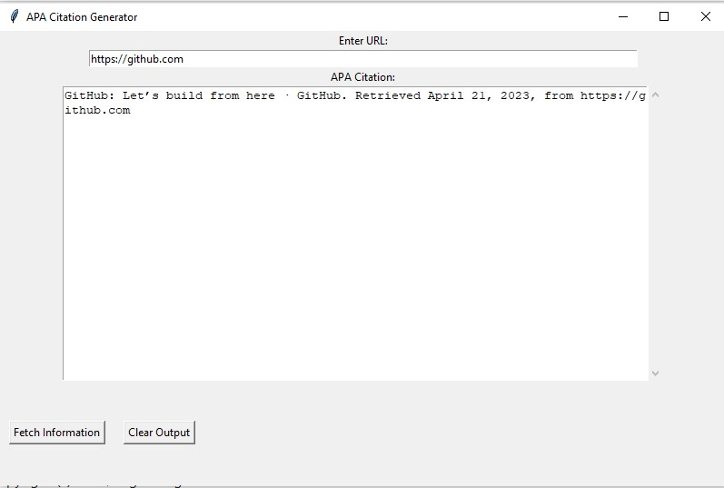

# APA Citation Generator
Copyright (c) 2023, Isrg. All rights reserved.

This Python script generates APA citations for a given URL. It uses BeautifulSoup and Selenium to fetch information from the webpage and generate the citation. The citation includes the title of the webpage, the published date, and the accessed date.

## Screenshot


## Installation
To run this script, you will need to install the following packages:
* requests
* tkinter
* beautifulsoup4
* selenium

You can install these packages using pip:
```
pip install requests tkinter beautifulsoup4 selenium
```

You will also need to download the ChromeDriver executable from [here](https://sites.google.com/a/chromium.org/chromedriver/downloads). Make sure to download the correct version for your operating system and place it in the same directory as the script.

## Usage
To use this script, simply run the following command:
```
python main.py
```

This will launch a GUI that allows you to enter a URL and fetch the APA citation for the webpage.

## Contributing
Pull requests are welcome. For major changes, please open an issue first to discuss what you would like to change.

## License
This project is licensed under the MIT License - see the [LICENSE](LICENSE) file for details.


